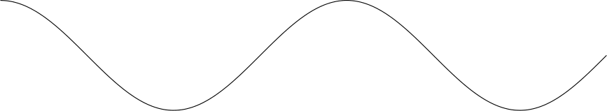
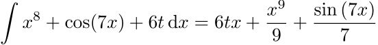
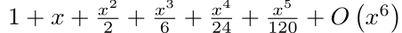
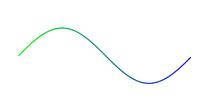

<h1 align="center">
  <a href="https://github.com/zongpingding/zTeX_bundle">zTeX bundle</a>
</h1>

<p align="center">
    <br />
    <br />
    <a href="https://www.tug.org/texlive/"></a>
    <a href="https://github.com/latex3/latex3"></a>
    <a href="https://hartwork.org/beamer-theme-matrix/"></a>
    <a href="https://tikz.dev/"></a>
    <a href="https://github.com/latex3/latex3/tree/develop/l3experimental/l3draw"></a>
    <a href="http://www.gnuplot.info/"></a>
    <a href="https://www.wolfram.com/wolframscript/"></a>
    <a href="https://www.python.org/"></a>
    <a href="https://www.sympy.org/en/index.html"></a>
    <br />
    <br />
</p>

---

`zTeX` is a LaTeX bundle developed by LaTeX 3, that used for writing documents. It consists of 4 parts:
* `zlatex`: a document class for wrting `Notes`, `Books` and `Slide`
* `ztikz`: a package mainly for drawing `2D diagrams`, `plots functions`. It also provide a interface to call the external program like `python`, `gnuplot`, `mathematica` and `matlab`. 
* `ztool(prepare)`: a package for providing some useful tools for LaTeX, like `shipout`, `key-value` set, `box-align`, `command define` and `patch/Hook` etc.
* ~~`zslide`: a package for beamer.~~ **(Now has been deprecated)**


## User's Manual
Users's manual for this bundle is provided in the `doc` folder of each module.

> [!IMPORTANT]
> Translation Needed, all manuals are written in Chinese now.

## Installation
> For `zTeX bundle` has not been uploaded to [CTAN](https://www.ctan.org/), This Installation guide will put the bundle in your USER's dir for LaTeX.

Download the latest version of the bundle from [zTeX bundle latese Release](https://github.com/zongpingding/zTeX_bundle/releases). Unzip the file and copy the files to your LaTeX user's folder, we call it `USER-DIR` in the following. In windows, it is usually located at
```text 
C:\Users\<YourName>\texmf\tex\latex\
```

in linux it is usually located at
```text
~/texmf/tex/latex/
```

then create a new folder named `zTeX` in the above `USER-DIR` and copy the files to `USER-DIR/zTeX`. After doing this, the `USER-DIR` structure will be like:
```shell 
USER-DIR
└── zTeX
    ├── doc
    │   ├── zlatex_manual.pdf
    │   ├── ztex_intro.pdf
    │   ├── ztikz_manual.pdf
    │   └── ztool_manual.pdf
    ├── modules
    │   ├── ztikzmodule.cache.tex
    │   ├── ztikzmodule.gnuplot.tex
    │   ├── ztikzmodule.python.tex
    │   ├── ztikzmodule.wolfram.tex
    │   └── ztikzmodule.zdraw.tex
    ├── zlatex.cls
    ├── ztikz.sty
    └── ztool.sty
```

If possible, run `texhash` to update the database.

## bundle introduction
Some detailed developing notes and bundle discription etc, are consist in `ztex_intro`. Feel free to read it ! If you just want to use this bundle immediately, see the following **Basic Usage** section for detailed guide.


## Basic Usage
For detailed guide on how to use this bundle, please see the manuals in this Bundle.


### zlatex
#### features
**1. Are you always feel confused by the argument position and the corresponding meaning when using a LaTeX commands?** `zLaTeX` solve this, most commands in `zlatex` is implemented as a `key-value` form, that makes you easy to use these commands. Some examples are:

* `slide mode` metadata setup
```latex
\zslideSetup{
  sec = {bg=ColorC,   fg=white, prefix=\ding{73}\ },
  UL  = {bg = ColorA, text=UL-TEXT\textcolor{white}{WHITE}, fg=ColorB},
  UR  = {text={\ifnum\arabic{subsection}=0\else Subsection\ \thesubsection\fi}},
  BC  = {text={\hyperlink{zslide-title-page}{\zslideTitle}}},
}
```

* example for `zlatex` options setup 
```latex 
\zlatexSetup{
  font = load, % require xetex or luatex
  toc = {
    column = 3,
    title = \hfill\large\normalfont CONTENTS {\sffamily\small NEW}\hfill,
    title-vspace = -5em
  },
  mathSpec = {
    alias=true,
    font=euler,
    envStyle=paris
  },
  bib_index = {
    load,
    source=ref.bib,
    backend=biber
  }
}
```

**2. Are you always satisfied with the options provided by a LaTeX package or class ?** `zlatex` provides the user so many options with default values to set up. Including:
* `document class` you used for writing, class options passing support.
* flexible `page layout` and `side notes` including figure in the margin.
* Many predefined theorem env styles and math font. You can also use your own env style by `HOOK` option provided by `zlatex`.
* Easy to transform your `article` or `book` to slide, if you use `zlatex` then you don't need to copy your source to a new beamer class and modify or add something in.
* Custom makes easy in `slide mode`, in slide mode `zlatex` provides a command `\zslideSetup` for custom slide theme, slide metadata, slide toc format, etc. 
* Easy to expand ! For example, you can easily add other languags or math env using the inner commands `\zlatex_keys_define:nn` or the pre-defined hooks `\zlatex_hook_preamble_last:n`, `\zlatex_hook_doc_begin:n` to make your own commands or environment
* ...

**3. Do you complain about the speed of a template ?** `zLaTeX` will checks the options you passed to it and loads the corresponding packages, that makes this template runs blazing fast by default. BTW, `zlatex` will load the neccessary packags instead of loading nothing to speed up the compiling.

**4. Can you understand the ouput error(warning) messages(log) when compiling ?** `zlatex` implements a user-friendly message(log) system to tell the user what happend and how to deal with it. The message generated by `zlatex` something like this:
```shell 
Class zlatex Warning: You use an invalid key "font" or key assign for it in
(zlatex)              the meta key "mathSpec", Valid options
(zlatex)              are:newtx,mtpro2,euler,mathpazo; Assignment Ignored and
(zlatex)              LaTeX default mathSpec settings substitute.


Class zlatex Warning: You use an invalid key "counter" or key assign for it in
(zlatex)              the meta key "mathSpec", Valid options
(zlatex)              are:alias(<bool>:false),envStyle,font(<choice>:newtx,mtpr
o2,euler,mathpazo);
(zlatex)              Assignment Ignored and LaTeX default mathSpec settings
(zlatex)              substitute.


Class zlatex Warning: You use an invalid key "openAll" or key assign for it in
(zlatex)              the meta key "layout", Valid options
(zlatex)              are:margin(<bool>:false),slide,aspect; Assignment
(zlatex)              Ignored and LaTeX default layout settings substitute.
```

sometimes, `zlatex` will automatically corrects the wrong commands for you and leaving a warning message:
```shell
Class zlatex Warning: MathEnv style:'paris' requires package 'tcolorbox' and
(zlatex)              'tikz', But either of them hasn't been loaded in your
(zlatex)              preamble. Reset to default 'plain' style now.
```

there are many other user-friendly features in `zlatex`, use it now ? See the following guide for a good starting.

#### article
A minimal working example acting as `article` is shown below:
```latex
\documentclass{zlatex}

\begin{document}
% your contents here
\end{document}
```

#### book 
To use the `book` class for writing, an example may be:
```latex 
\documentclass[class=book]{zlatex}

\begin{document}
\maketitle
\frontmatter
\tableofcontents

\mainmatter
\chapter{First Chapter}
\section{First section}
% your contents here
\end{document}
```

#### slide 
To transform your `article` or `book` to `slide`, you need to add a `slide` option to `layout` key in class option. An example maybe:
```latex 
\documentclass[
  layout={slide, aspect=16|9}
]{zlatex}


\begin{document}
% 1. your original contents writing in 'article' or 'book' here.
% 2. zlatex will automatically handle the original material in a proper way.
\end{document}
```

#### switch language
`zlatex` now support 2 languages: `english` and `chinses`, set the `lang` class option to `en` or `cn` to enable it. Set this key like:
```latex 
\documentclass[lang=cn]{zlatex}
```

default language is `english`.


#### other options
There are so many options pre-defined in `zlatex`, please see the manual for more information. 


### ztikz
Use command
```latex 
\ztikzLoadModule{<module name>}
```

to load the `ztikz` to load the submodule of ztikz that you need. All available submodules are:
* `cache`
* `gnuplot`
* `python`
* `wolfram`
* `zdraw`

> [!CAUTION]
> All these modules in `ztikz` need you to turn `shell escape` on. Be cautious when using this module.

#### preface
To make `ztikz` run in your local, there are some additional settings you need to do. `ztikz` split it's macros to different modules according to functions these macros play on. Now, the main modules are:
* `cache`: used to cache the result of the previous call of external programs. The cache function for original tikz is provided by tkz library `external`. Others are implemented by command `\ztikz_hash_if_change_cs:n {<file-name>}`.
* `gnuplot`: use gnuplot to generate plot data, tikz to plot to data generated by gnuplot. This is **blazing fast** when you plot some complex functions compare to the default tikz.
* `python`: call the external python to plot figure, do calculation. For example, `Sympy` can be used to calculate the integral or do some matrix operations in linear algebra.
* `wolfram`: use `wolframscript` to do calculations, include plotting figures.
* `zdraw`: this module provide some useful commands to draw a `shaded object`, `a function`. This module is implemented by `l3draw`, thus you don't need to load `tikz` for some simple plotting tasks, just load this module and play with it.

Each module can be loaded and used separately.Find out what you need and install the corresponding external program.


#### env config
Only `wolframscript`, `gnuplot` and `python` need additional settings. I'll simply introduc how to config this environments the following, for detailed instructions, please read the corresponding sections in the providing manuals.


> [!CAUTION]
> All these modules is based on `sed`, for linux user, it is easy to handle. For windows users, you may need to using one of the ways: [Cygwin](https://cygwin.com/), [MSYS2](https://www.msys2.org/), [WSL](https://learn.microsoft.com/zh-cn/windows/wsl/install) or a `package manager` to install `sed`.


* For gnuplot setup:
    * in linux, you can use your package manager to install it. On windows, using [scoop](https://scoop.sh/) or [chocolatey](https://chocolatey.org/) or Download the `EXE` in the official gnuplot site: [gnuplot](http://www.gnuplot.info/).
    * check if the gnuplot can been accessed in your shell.
    * compile your document turning `shell escape` on.
* For python setup:
    * install python first
    * using your package manager to install `matplotlib` and `sympy`
    * check installations, then all is done.
    * compile your document turning `shell escape` on.
* For wolframscript:
    * please see the official installations on [wolframscript Installation](https://www.wolfram.com/wolframscript/)
    * If you already have wolframscript setup in your windows, then you can create a soft link in [WSL](https://learn.microsoft.com/zh-cn/windows/wsl/install) to make it works in your WSL:
        ```shell 
        ln -sf "/mnt/c/Program Files/Wolfram Research/WolframScript/wolframscript.exe" /usr/bin/wolframscript
        ```
        > pay attention to the wolframscript folder.
    * If wolframscript setup successfully, then everything is done. 
    * compile your document turning `shell escape` on.

#### basic examples
A series of basic examples to test different modules in `ztikz` listed below:

1. `gnuplot` example:
```latex
\documentclass{standalone}
\usepackage{ztikz}
\ztikzLoadModule{gnuplot}

\begin{document}
\begin{tikzpicture}
    \Plot[-1.5*pi:2*pi]{sin(x)}
\end{tikzpicture}
\end{document}
```

The output will be:
<p align="center">

</p>

2. `python` example:
```latex
\documentclass{standalone}
\usepackage{ztikz}
\ztikzLoadModule{python}

\begin{document}
  \(\displaystyle\int x^8 + \cos(7x) + 6t\,\mathrm{d}x = \sympy{integrate( x**8 + cos(7*x) + 6*t, x )}\)
\end{document}
```

The output will be:
<p align="center">

</p>

3. `wolframscript` example:
```latex
\documentclass{standalone}
\usepackage{ztikz}
\ztikzLoadModule{cache, wolfram}


\begin{document}
% call the wolframscript
\wolfram{Series[Exp[x], {x, 0, 5}]}

% import the result
\(\wolframResult\)
\end{document}
```
The fisrt time you compile it, there will be a log:
```shell
current hash is 637191695943FF88742EB181936998A6
current hash is unique --> recorded
```
that means `ztikz` has successfully generates the result and remeber this call (by the wolframscript file `hash`).
the next time you compile it, there will be a log:
```shell
current hash is 637191695943FF88742EB181936998A6
skip recompile, using the cache wolframscript result 1
```
and this time is much faster than before. Only when you change this call args(`Series[Exp[x], {x, 0, 5}]`), the `wolframscript` will be called again.

The output will be:
<p align="center">

</p>


4. `cache` example: see the above examples for wolframscript. We implement the first example about `gnuplot` with `cache`. The code will be:
```latex 
\documentclass{standalone}
\usepackage{ztikz}
\ztikzLoadModule{cache, gnuplot}

\begin{document}
\begin{tikzpicture}
    \Plot[-1.5*pi:2*pi]{sin(x)}
\end{tikzpicture}
\end{document}
```
the second time you compile it, there will be a log:
```shell 
===== Image 'ztikz_output/tikz_data/test-figure0' is up-to-date. ======
```
that means this time we use the cache result generated in the first time.


5. `zdraw` example:
```latex
\documentclass{article}
\usepackage{ztikz}
\ztikzLoadModule{zdraw}

\begin{document}
\begin{zdraw}
\zplot[
    domain={0, 0.02*\c_pi_fp, 2*\c_pi_fp}, 
    action=shade, startColor=blue,
    endColor=green, axis=x
]{sin(x)}
\end{zdraw}
\end{document}
```

The output will be:
<p align="center">

</p>

## For Advanced User
### Compile manual
To compile the users' manuals of this bundle, switching to the module directory and use `l3build doc` to compile the corresponding manual. Building the `ztikz` manual from scratch will take a long time, be patient(in my computer, about **7 mins**). For that there are so many tikz pictures and external programs called in the manual. The second time you compile it, it will be much faster(about **20s**). 

> For better output, Set `typesetruns = 3` to typeset this manual.

For `zlatex`, `ztex_intro` and `ztool` manual, it will be much faster than `ztikz` manual.

### zlatex 
In slide mode, `zlatex` uses these 3 basic commands:
```latex 
\_zslide_status_bar:nnnn {<start point>}{<bar color Tag>}{<rule width>}{<rule height>}

\_slide_status_metadate:nnn {<head/foot>}{<start x-coor>}{<hbox width>}{<hbox content>}

\_slide_metadate:n {<bar tag>}
```

to create the `status bar`, `status metadata box` and `status metadata`. You can use these commands to create your slide own theme.

> Maybe in the future, `zlatex` will provide a more interfaces to advanced users.


### ztikz 
In `ztikz`, the uniformal interface of external programs calling hasn't been implemented yet. They are still in separate modules. You still can the following commands to create your own commands:

#### gnuplot 
```latex
\ztikz_gnu_data_plot_cs:nnn {<plot type>}{<plot style>}{<plot marker key-value list>}
```

This function will check the `plot type` and check the cache. Finaly it will the plot data generated by `gnuplot`.

#### wolframscript
```latex 
\ztikz_wolfram_input_result_cs:
```

This command will automatically write and collects the contents in file `\g__ztikz_mma_path_tl/mma_res_\int_use:N \g__mma_text_index_int.txt`, where:

* `\g__ztikz_mma_path_tl` default set to './ztikz_output/mma_data/'
* `\g__mma_text_index_int` is the index of cache file, and push the content which is separated be comma (`,`) to variable `\l__wolfram_temp_res_tl` for further use.

After run this command, you can use the content using command `\wolframResult`, the implement of this command is:

```latex 
% macro storage the mma-result
\NewDocumentCommand\wolframResult{O{raw}O{}}{
  \tl_if_eq:nnTF {#1}{raw}{
      \seq_use:Nnnn \l__wolfram_temp_res_seq {#2}{#2}{#2}
  }{
    \if_is_int:xTF {\int_eval:n {#1}}
      {\seq_item:Nn \l__wolfram_temp_res_seq {#1}}{}
  }
}
```

### ztool
Preparing ...


## Pull Request
### Pre-requirements
This bundle uses `l3build` to run code testing. If you want to improve this project and Pull a Request after changing code in `class`, `package` or `module`, make sure to run the test and pass it before you commit your code.

> [!TIP]
> Be cautious the `checkruns` variable when running the test for `doc-XX-output`, where `XX` represents `article`, `book` or `slide`. The last member need at least `3` run-times to pass the `PDF`-based test while the rest need `2` run-times.


### manifest
Each module contains a `Manifest` that discripes:
* Source files
* Checking-specific support files
* Test files

of each module. To get the `Manifest.md`, Tips in `l3doc.pdf`:
> In order for manifest to detect derived and typeset files, it should be run after running unpack and doc.


### run test 
By setting the variable `modules` in `./build.lua` in root dir or change to the module dir. 

1. Take `ztool` for an example, change directory to `ztool` module and run the following command:
```shell
l3build save ztool-cmd-ztool
```

2. Or set `modules = {"ztool"}` in `./build.lua` and run the following command in root dir:
```shell
l3build save ztool-cmd-ztool
```

WELCOME TO CONTRIBUTE TO THIS PROJECT !